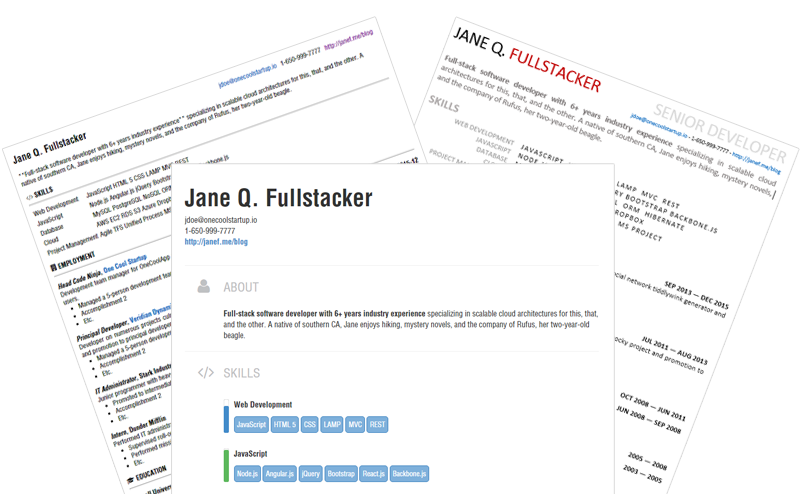

HackMyResume
============

[![Latest release][img-release]][latest-release]
[![Build status (MASTER)][img-master]][travis-url-master]
[![Build status (DEV)][img-dev]][travis-url-dev]

*Create polished résumés and CVs in multiple formats from your command line or
shell. Author in clean Markdown and JSON, export to Word, HTML, PDF, LaTeX,
plain text, and other arbitrary formats. Fight the power, save trees. Compatible
with [FRESH][fresca] and [JRS][6] resumes.*



HackMyResume is a dev-friendly, local-only Swiss Army knife for resumes and CVs.
Use it to:

1. **Generate** HTML, Markdown, LaTeX, MS Word, PDF, plain text, JSON, XML,
YAML, print, smoke signal, carrier pigeon, and other arbitrary-format resumes
and CVs, from a single source of truth&mdash;without violating DRY.
2. **Analyze** your resume for keyword density, gaps/overlaps, and other
metrics.
3. **Convert** resumes between [FRESH][fresca] and [JSON Resume][6] formats.
4. **Validate** resumes against either format.

HackMyResume is built with Node.js and runs on recent versions of OS X, Linux,
or Windows. View the [FAQ](FAQ.md).

## Features

- OS X, Linux, and Windows.
- Choose from dozens of FRESH or JSON Resume themes.
- Private, local-only resume authoring and analysis.
- Analyze your resume for keywords, gaps, and other metrics.
- Store your resume data as a durable, versionable JSON or YAML document.
- Generate polished resumes in multiple formats without violating [DRY][dry].
- Output to HTML, Markdown, LaTeX, PDF, MS Word, JSON, YAML, plain text, or XML.
- Validate resumes against the FRESH or JSON Resume schema.
- Support for multiple input and output resumes.
- Convert between FRESH and JSON Resume resumes.
- Use from your command line or [desktop][7].
- Free and open-source through the MIT license.
- Updated daily / weekly. Contributions are [welcome](CONTRIBUTING.md).

## Install

Install the latest stable version of HackMyResume with NPM:

```bash
[sudo] npm install hackmyresume -g
```

Alternately, install the latest bleeding-edge version (updated daily):

```bash
[sudo] npm install hacksalot/hackmyresume#dev -g
```

## Installing PDF Support (optional)

HackMyResume tries not to impose a specific PDF engine requirement on
the user, but will instead work with whatever PDF engines you have installed.

Currently, HackMyResume's PDF generation requires either [Phantom.js][2] or
[wkhtmltopdf][3] to be installed on your system and the `phantomjs` and/or
`wkhtmltopdf` binaries to be accessible on your PATH. This is an optional
requirement for users who care about PDF formats. If you don't care about PDF
formats, skip this step.

## Installing Themes

HackMyResume supports both [FRESH][fresh-themes] and [JSON Resume][jrst]-style
résumé themes.

- FRESH themes currently come preinstalled with HackMyResume.
- JSON Resume themes can be installed from NPM, GitHub, or manually.

To install a JSON Resume theme, just `cd` to the folder where you want to store
your themes and run one of:

```bash
# Install with NPM
npm install jsonresume-theme-[theme-name]

# Install with GitHub
git clone https://github.com/[user-or-org]/[repo-name]
```

Then when you're ready to generate your resume, just reference the location of
the theme folder as you installed it:

```bash
hackmyresume BUILD resume.json TO out/resume.all -t node_modules/jsonresume-theme-classy
```

Note: You can use install themes anywhere on your file system. You don't need a
package.json or other NPM/Node infrastructure.

## Getting Started

To use HackMyResume you'll need to create a valid resume in either
[FRESH][fresca] or [JSON Resume][6] format. Then you can start using the command
line tool. There are five basic commands you should be aware of:

- **build** generates resumes in HTML, Word, Markdown, PDF, and other formats.
Use it when you need to submit, upload, print, or email resumes in specific
formats.

    ```bash
    # hackmyresume BUILD <INPUTS> TO <OUTPUTS> [-t THEME]
    hackmyresume BUILD resume.json TO out/resume.all
    hackmyresume BUILD r1.json r2.json TO out/rez.html out/rez.md foo/rez.all
    ```

- **new** creates a new resume in FRESH or JSON Resume format.

    ```bash
    # hackmyresume NEW <OUTPUTS> [-f <FORMAT>]
    hackmyresume NEW resume.json
    hackmyresume NEW resume.json -f fresh
    hackmyresume NEW r1.json r2.json -f jrs
    ```

- **analyze** inspects your resume for keywords, duration, and other metrics.

- **convert** converts your source resume between FRESH and JSON Resume
formats. Use it to convert between the two formats to take advantage of tools
and services.

    ```bash
    # hackmyresume CONVERT <INPUTS> TO <OUTPUTS>
    hackmyresume CONVERT resume.json TO resume-jrs.json
    hackmyresume CONVERT 1.json 2.json 3.json TO out/1.json out/2.json out/3.json
    ```

- **validate** validates the specified resume against either the FRESH or JSON
Resume schema. Use it to make sure your resume data is sufficient and complete.

    ```bash
    # hackmyresume VALIDATE <INPUTS>
    hackmyresume VALIDATE resume.json
    hackmyresume VALIDATE r1.json r2.json r3.json
    ```

## Supported Output Formats

HackMyResume supports these output formats:

Output Format | Ext | Notes
------------- | --- | -----
HTML | .html | A standard HTML 5 + CSS resume format that can be viewed in a browser, deployed to a website, etc.
Markdown | .md | A structured Markdown document that can be used as-is or used to generate HTML.
LaTeX | .tex | A structured LaTeX document (or collection of documents) that can be processed with pdflatex, xelatex, and similar tools.
MS Word | .doc | A Microsoft Word office document (XML-driven; WordProcessingML).
Adobe Acrobat (PDF) | .pdf | A binary PDF document driven by an HTML theme (through wkhtmltopdf).
plain text | .txt | A formatted plain text document appropriate for emails or copy-paste.
JSON | .json | A JSON representation of the resume.
YAML | .yml | A YAML representation of the resume.
RTF | .rtf | Forthcoming.
Textile | .textile | Forthcoming.
image | .png, .bmp | Forthcoming.

## Use

Assuming you've got a JSON-formatted resume handy, generating resumes in
different formats and combinations easy. Just run:

```bash
hackmyresume BUILD <INPUTS> <OUTPUTS> [-t theme].
```

Where `<INPUTS>` is one or more .json resume files, separated by spaces;
`<OUTPUTS>` is one or more destination resumes, and `<THEME>` is the desired
theme (default to Modern). For example:

```bash
# Generate all resume formats (HTML, PDF, DOC, TXT, YML, etc.)
hackmyresume BUILD resume.json TO out/resume.all -t modern

# Generate a specific resume format
hackmyresume BUILD resume.json TO out/resume.html
hackmyresume BUILD resume.json TO out/resume.pdf
hackmyresume BUILD resume.json TO out/resume.md
hackmyresume BUILD resume.json TO out/resume.doc
hackmyresume BUILD resume.json TO out/resume.json
hackmyresume BUILD resume.json TO out/resume.txt
hackmyresume BUILD resume.json TO out/resume.yml

# Specify 2 inputs and 3 outputs
hackmyresume BUILD in1.json in2.json TO out.html out.doc out.pdf
```

You should see something to the effect of:

```
*** HackMyResume v1.4.0 ***
Reading JSON resume: foo/resume.json
Applying MODERN Theme (7 formats)
Generating HTML resume: out/resume.html
Generating TXT resume: out/resume.txt
Generating DOC resume: out/resume.doc
Generating PDF resume: out/resume.pdf
Generating JSON resume: out/resume.json
Generating MARKDOWN resume: out/resume.md
Generating YAML resume: out/resume.yml
```

## Advanced

### Applying a theme

HackMyResume can work with any FRESH or JSON Resume theme. To specify a theme
when generating your resume, use the `-t` or `--theme` parameter:

```bash
hackmyresume BUILD resume.json TO out/rez.all -t [theme]
```

The `[theme]` parameter can be the name of a predefined theme or the path to any
FRESH or JSON Resume theme folder:

```bash
hackmyresume BUILD resume.json TO out/rez.all -t modern
hackmyresume BUILD resume.json TO OUT.rez.all -t ../some-folder/my-custom-theme/
hackmyresume BUILD resume.json TO OUT.rez.all -t npm_modules/jsonresume-theme-classy
```

As of v1.4.0, available predefined themes are `positive`, `modern`, `compact`,
`minimist`, and `hello-world`.

### Merging resumes

You can **merge multiple resumes together** by specifying them in order from
most generic to most specific:

```bash
# Merge specific.json onto base.json and generate all formats
hackmyresume BUILD base.json specific.json TO resume.all
```

This can be useful for overriding a base (generic) resume with information from
a specific (targeted) resume. For example, you might override your generic
catch-all "software developer" resume with specific details from your targeted
"game developer" resume, or combine two partial resumes into a "complete"
resume. Merging follows conventional [extend()][9]-style behavior and there's
no arbitrary limit to how many resumes you can merge:

```bash
hackmyresume BUILD in1.json in2.json in3.json in4.json TO out.html out.doc
Reading JSON resume: in1.json
Reading JSON resume: in2.json
Reading JSON resume: in3.json
Reading JSON resume: in4.json
Merging in4.json onto in3.json onto in2.json onto in1.json
Generating HTML resume: out.html
Generating WORD resume: out.doc
```

### Multiple targets

You can specify **multiple output targets** and HackMyResume will build them:

```bash
# Generate out1.doc, out1.pdf, and foo.txt from me.json.
hackmyresume BUILD me.json TO out1.doc out1.pdf foo.txt
```

### Using .all

The special `.all` extension tells HackMyResume to generate all supported output
formats for the given resume. For example, this...

```bash
# Generate all resume formats (HTML, PDF, DOC, TXT, etc.)
hackmyresume BUILD me.json TO out/resume.all
```

..tells HackMyResume to read `me.json` and generate `out/resume.md`,
`out/resume.doc`, `out/resume.html`, `out/resume.txt`, `out/resume.pdf`, and
`out/resume.json`.

### Building PDFs

HackMyResume takes a unique approach to PDF generation. Instead of enforcing
a specific PDF engine on users, HackMyResume will attempt to work with whatever
PDF engine you have installed through the engine's command-line interface (CLI).
Currently that means one or both of...

- [wkhtmltopdf][3]
- [Phantom.js][3]

..with support for other engines planned in the future. **One or both of these
engines must be installed and accessible on your PATH in order to generate PDF
resumes with HackMyResume**. That means you should be able to invoke either of
these tools directly from your shell or terminal without error:

```bash
wkhtmltopdf input.html output.pdf
phantomjs script.js input.html output.pdf
```

Assuming you've installed one or both of these engines on your system, you can
tell HackMyResume which flavor of PDF generation to use via the `--pdf` option
(`-p` for short):

```bash
hackmyresume BUILD resume.json TO out.all --pdf phantom
hackmyresume BUILD resume.json TO out.all --pdf wkhtmltopdf
hackmyresume BUILD resume.json TO out.all --pdf none
```

### Analyzing

HackMyResume can analyze your resume for keywords, employment gaps, and other
metrics. Run:

```bash
hackmyresume ANALYZE <my-resume>.json
```

Depending on the HackMyResume version, you should see output similar to:


```
*** HackMyResume v1.6.0 ***
Reading resume: resume.json
Analyzing FRESH resume: resume.json

SECTIONS (10):

        employment:    12
         education:     2
           service:     1
            skills:     8
           writing:     1
       recognition:     0
            social:     4
         interests:     2
        references:     1
         languages:     2

COVERAGE (61.1%):

        Total Days:  6034
          Employed:  3688
              Gaps:     8  [31, 1065, 273, 153, 671, 61, 61, 31]
          Overlaps:     1  [243]

KEYWORDS (61):

           Node.js:     6 mentions
        JavaScript:     9 mentions
        SQL Server:     3 mentions
     Visual Studio:     6 mentions
           Web API:     1 mentions
   N-tier / 3-tier:     1 mentions
            HTML 5:     1 mentions
        JavaScript:     6 mentions
               CSS:     2 mentions
Sass / LESS / SCSS:     1 mentions
              LAMP:     3 mentions
              WISC:     1 mentions
              HTTP:    21 mentions
              JSON:     1 mentions
               XML:     2 mentions
              REST:     1 mentions
        WebSockets:     2 mentions
       Backbone.js:     3 mentions
        Angular.js:     1 mentions
           Node.js:     4 mentions
               NPM:     1 mentions
             Bower:     1 mentions
             Grunt:     2 mentions
              Gulp:     1 mentions
            jQuery:     2 mentions
         Bootstrap:     3 mentions
     Underscore.js:     1 mentions
         PhantomJS:     1 mentions
      CoffeeScript:     1 mentions
            Python:    11 mentions
              Perl:     4 mentions
               PHP:     7 mentions
             MySQL:    12 mentions
        PostgreSQL:     4 mentions
             NoSQL:     2 mentions
            Apache:     2 mentions
               AWS:     2 mentions
               EC2:     2 mentions
               RDS:     3 mentions
                S3:     1 mentions
             Azure:     1 mentions
         Rackspace:     1 mentions
               C++:    23 mentions
            C++ 11:     1 mentions
             Boost:     1 mentions
             Xcode:     2 mentions
               gcc:     1 mentions
             OO&AD:     1 mentions
              .NET:    20 mentions
           Unity 5:     2 mentions
              Mono:     3 mentions
       MonoDevelop:     1 mentions
           Xamarin:     1 mentions
             TOTAL:   180 mentions
```

### Validating

HackMyResume can also validate your resumes against either the [FRESH /
FRESCA][fresca] or [JSON Resume][6] formats. To validate one or more existing
resumes, use the `validate` command:

```bash
# Validate myresume.json against either the FRESH or JSON Resume schema.
hackmyresume VALIDATE resumeA.json resumeB.json
```

HackMyResume will validate each specified resume in turn:

```bash
*** HackMyResume v1.6.0 ***
Validating JSON resume: resumeA.json (INVALID)
Validating JSON resume: resumeB.json (VALID)
```

### Converting

HackMyResume can convert between the [FRESH][fresca] and [JSON Resume][6]
formats. Just run:

```bash
hackmyresume CONVERT <INPUTS> <OUTPUTS>
```

where <INPUTS> is one or more resumes in FRESH or JSON Resume format, and
<OUTPUTS> is a corresponding list of output file names. HackMyResume will
autodetect the format (FRESH or JRS) of each input resume and convert it to the
other format (JRS or FRESH).

### External options

Starting in v1.4.x you can pass options into HackMyResume via an external
options or ".hackmyrc" file.

```javascript
{
  // Set the default theme to "compact"
  "theme": "compact",
  // Change the "employment" section title text to "Work"
  "sectionTitles": {
    "employment": "Work"
  }
}
```

### Prettifying

HackMyResume applies [js-beautify][10]-style HTML prettification by default to
HTML-formatted resumes. To disable prettification, the `--no-prettify` or `-n`
flag can be used:

```bash
hackmyresume BUILD resume.json out.all --no-prettify
```

### Silent Mode

Use `-s` or `--silent` to run in silent mode:

```bash
hackmyresume BUILD resume.json -o someFile.all -s
hackmyresume BUILD resume.json -o someFile.all --silent
```

### Debug Mode

Use `-d` or `--debug` to force HMR to emit a call stack when errors occur. In
the future, this option will emit detailed error logging.

```bash
hackmyresume BUILD resume.json -d
hackmyresume ANALYZE resume.json --debug
```

## Contributing

HackMyResume is a community-driven free and open source project under the MIT
License. Contributions are encouraged and we respond to all PRs and issues,
usually within 24 hours. See [CONTRIBUTING.md][contribute] for details.

## License

MIT. Go crazy. See [LICENSE.md][1] for details.

[1]: LICENSE.md
[2]: http://phantomjs.org/
[3]: http://wkhtmltopdf.org/
[4]: https://nodejs.org/
[5]: https://www.npmjs.com/
[6]: http://jsonresume.org
[7]: http://fluentcv.com
[8]: https://youtu.be/N9wsjroVlu8
[9]: https://api.jquery.com/jquery.extend/
[10]: https://github.com/beautify-web/js-beautify
[fresh]: https://github.com/fluentdesk/FRESH
[fresca]: https://github.com/fluentdesk/FRESCA
[dry]: https://en.wikipedia.org/wiki/Don%27t_repeat_yourself
[img-release]: https://img.shields.io/github/release/hacksalot/HackMyResume.svg?label=version
[img-master]: https://img.shields.io/travis/hacksalot/HackMyResume/master.svg
[img-dev]: https://img.shields.io/travis/hacksalot/HackMyResume/dev.svg?label=dev
[travis-url-master]: https://travis-ci.org/hacksalot/HackMyResume?branch=master
[travis-url-dev]: https://travis-ci.org/hacksalot/HackMyResume?branch=dev
[latest-release]: https://github.com/hacksalot/HackMyResume/releases/latest
[contribute]: CONTRIBUTING.md
[fresh-themes]: https://github.com/fluentdesk/fresh-themes
[jrst]: https://www.npmjs.com/search?q=jsonresume-theme
