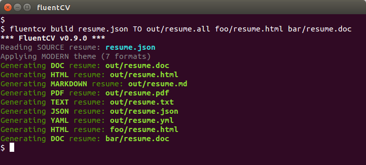

fluentCV
========
*Create polished technical résumés and CVs in multiple formats from your command
line or shell. See [FluentCV Desktop][7] for the desktop version. OS X ~ Windows
~ Linux.*



FluentCV is a dev-friendly Swiss Army knife for resumes and CVs. Use it to:

1. **Generate** HTML, Markdown, LaTeX, MS Word, PDF, plain text, JSON, XML,
YAML, print, smoke signal, carrier pigeon, and other arbitrary-format resumes
and CVs, from a single source of truth&mdash;without violating DRY.
2. **Convert** resumes between [FRESH][fresca] and [JSON Resume][6] formats.
3. **Validate** resumes against either format.

FluentCV supports both the [FRESH][fresca] and [JSON Resume][6] source formats.

## Features

- OS X, Linux, and Windows.
- Store your resume data as a durable, versionable JSON or YAML document.
- Generate polished resumes in multiple formats without violating [DRY][dry].
- Output to HTML, Markdown, LaTeX, PDF, MS Word, JSON, YAML, plain text, or XML.
- Compatible with [FRESH][fresh], [JSON Resume][6], [FRESCA][fresca], and
[FCV Desktop][7].
- Validate resumes against the FRESH or JSON Resume schema.
- Support for multiple input and output resumes.
- Use from your command line or [desktop][7].
- Free and open-source through the MIT license.

## Install

Install FluentCV with NPM:

```bash
[sudo] npm install fluentcv -g
```

Note: for PDF generation you'll need to install a copy of [wkhtmltopdf][3] for
your platform. For LaTeX generation you'll need a valid LaTeX environment with
access to `xelatex` and similar.

## Getting Started

To use FluentCV you'll need to create a valid resume in either [FRESH][fresca]
or [JSON Resume][6] format. Then you can start using the command line tool.
There are four basic commands you should be aware of:

- `build` generates resumes in HTML, Word, Markdown, PDF, and other formats. Use
it when you need to submit, upload, print, or email resumes in specific formats.

    ```bash
    # fluentcv BUILD <INPUTS> TO <OUTPUTS> [-t THEME]
    fluentcv BUILD resume.json TO out/resume.all
    fluentcv BUILD r1.json r2.json TO out/rez.html out/rez.md foo/rez.all
    ```

- `new` creates a new resume in FRESH or JSON Resume format.

    ```bash
    # fluentcv NEW <OUTPUTS> [-f <FORMAT>]
    fluentcv NEW resume.json
    fluentcv NEW resume.json -f fresh
    fluentcv NEW r1.json r2.json -f jrs
    ```

- `convert` converts your source resume between FRESH and JSON Resume formats.
Use it to convert between the two formats to take advantage of tools and services.

    ```bash
    # fluentcv CONVERT <INPUTS> TO <OUTPUTS>
    fluentcv CONVERT resume.json TO resume-jrs.json
    fluentcv CONVERT 1.json 2.json 3.json TO out/1.json out/2.json out/3.json
    ```

- `validate` validates the specified resume against either the FRESH or JSON
Resume schema. Use it to make sure your resume data is sufficient and complete.

    ```bash
    # fluentcv VALIDATE <INPUTS>
    fluentcv VALIDATE resume.json
    fluentcv VALIDATE r1.json r2.json r3.json
    ```

## Supported Output Formats

FluentCV supports these output formats:

Output Format | Ext | Notes
------------- | --- | -----
HTML | .html | A standard HTML 5 + CSS resume format that can be viewed in a browser, deployed to a website, etc.
Markdown | .md | A structured Markdown document that can be used as-is or used to generate HTML.
LaTeX | .tex | A structured LaTeX document (or collection of documents).
MS Word | .doc | A Microsoft Word office document.
Adobe Acrobat (PDF) | .pdf | A binary PDF document driven by an HTML theme.
plain text | .txt | A formatted plain text document appropriate for emails or copy-paste.
JSON | .json | A JSON representation of the resume.
YAML | .yml | A YAML representation of the resume.
RTF | .rtf | Forthcoming.
Textile | .textile | Forthcoming.
image | .png, .bmp | Forthcoming.

## Install

FluentCV requires a recent version of [Node.js][4] and [NPM][5]. Then:

1. Install the latest official [wkhtmltopdf][3] binary for your platform.
2. Optionally install an updated LaTeX environment (LaTeX resumes only).
2. Install **fluentCV** with `[sudo] npm install fluentcv -g`.
3. You're ready to go.

## Use

Assuming you've got a JSON-formatted resume handy, generating resumes in
different formats and combinations easy. Just run:

```bash
fluentcv BUILD <INPUTS> <OUTPUTS> [-t theme].
```

Where `<INPUTS>` is one or more .json resume files, separated by spaces;
`<OUTPUTS>` is one or more destination resumes, and `<THEME>` is the desired
theme (default to Modern). For example:

```bash
# Generate all resume formats (HTML, PDF, DOC, TXT, YML, etc.)
fluentcv build resume.json -o out/resume.all -t modern

# Generate a specific resume format
fluentcv build resume.json TO out/resume.html
fluentcv build resume.json TO out/resume.pdf
fluentcv build resume.json TO out/resume.md
fluentcv build resume.json TO out/resume.doc
fluentcv build resume.json TO out/resume.json
fluentcv build resume.json TO out/resume.txt
fluentcv build resume.json TO out/resume.yml

# Specify 2 inputs and 3 outputs
fluentcv build in1.json in2.json TO out.html out.doc out.pdf
```

You should see something to the effect of:

```
*** FluentCV v0.9.0 ***
Reading JSON resume: foo/resume.json
Applying MODERN Theme (7 formats)
Generating HTML resume: out/resume.html
Generating TXT resume: out/resume.txt
Generating DOC resume: out/resume.doc
Generating PDF resume: out/resume.pdf
Generating JSON resume: out/resume.json
Generating MARKDOWN resume: out/resume.md
Generating YAML resume: out/resume.yml
```

## Advanced

### Applying a theme

You can specify a predefined or custom theme via the optional `-t` parameter. For a predefined theme, include the theme name. For a custom theme, include the path to the custom theme's folder.

```bash
fluentcv build resume.json -t modern
fluentcv build resume.json -t ~/foo/bar/my-custom-theme/
```

As of v0.9.0, available predefined themes are `modern`, `minimist`, and `hello-world`, and `compact`.

### Merging resumes

You can **merge multiple resumes together** by specifying them in order from most generic to most specific:

```bash
# Merge specific.json onto base.json and generate all formats
fluentcv build base.json specific.json -o resume.all
```

This can be useful for overriding a base (generic) resume with information from a specific (targeted) resume. For example, you might override your generic catch-all "software developer" resume with specific details from your targeted "game developer" resume, or combine two partial resumes into a "complete" resume. Merging follows conventional [extend()][9]-style behavior and there's no arbitrary limit to how many resumes you can merge:

```bash
fluentcv build in1.json in2.json in3.json in4.json TO out.html out.doc
Reading JSON resume: in1.json
Reading JSON resume: in2.json
Reading JSON resume: in3.json
Reading JSON resume: in4.json
Merging in4.json onto in3.json onto in2.json onto in1.json
Generating HTML resume: out.html
Generating WORD resume: out.doc
```

### Multiple targets

You can specify **multiple output targets** and FluentCV will build them:

```bash
# Generate out1.doc, out1.pdf, and foo.txt from me.json.
fluentcv build me.json -o out1.doc -o out1.pdf -o foo.txt
```

You can also omit the output file(s) and/or theme completely:

```bash
# Equivalent to "fluentcv resume.json resume.all -t modern"
fluentcv build resume.json
```

### Using .all

The special `.all` extension tells FluentCV to generate all supported output formats for the given resume. For example, this...

```bash
# Generate all resume formats (HTML, PDF, DOC, TXT, etc.)
fluentcv build me.json -o out/resume.all
```

..tells FluentCV to read `me.json` and generate `out/resume.md`, `out/resume.doc`, `out/resume.html`, `out/resume.txt`, `out/resume.pdf`, and `out/resume.json`.

### Validating

FluentCV can also validate your resumes against either the [FRESH /
FRESCA][fresca] or [JSON Resume][6] formats. To validate one or more existing
resumes, use the `validate` command:

```bash
# Validate myresume.json against either the FRESH or JSON Resume schema.
fluentcv validate resumeA.json resumeB.json
```

FluentCV will validate each specified resume in turn:

```bash
*** FluentCV v0.9.0 ***
Validating JSON resume: resumeA.json (INVALID)
Validating JSON resume: resumeB.json (VALID)
```

### Converting

FluentCV can convert between the [FRESH][fresca] and [JSON Resume][6] formats.
Just run:

```bash
fluentcv CONVERT <INPUTS> <OUTPUTS>
```

where <INPUTS> is one or more resumes in FRESH or JSON Resume format, and
<OUTPUTS> is a corresponding list of output file names. FluentCV will autodetect
the format (FRESH or JRS) of each input resume and convert it to the other
format (JRS or FRESH).

### Prettifying

FluentCV applies [js-beautify][10]-style HTML prettification by default to
HTML-formatted resumes. To disable prettification, the `--nopretty` or `-n` flag
can be used:

```bash
fluentcv generate resume.json out.all --nopretty
```

### Silent Mode

Use `-s` or `--silent` to run in silent mode:

```bash
fluentcv generate resume.json -o someFile.all -s
fluentcv generate resume.json -o someFile.all --silent
```

## License

MIT. Go crazy. See [LICENSE.md][1] for details.

[1]: LICENSE.md
[2]: http://phantomjs.org/
[3]: http://wkhtmltopdf.org/
[4]: https://nodejs.org/
[5]: https://www.npmjs.com/
[6]: http://jsonresume.org
[7]: http://fluentcv.com
[8]: https://youtu.be/N9wsjroVlu8
[9]: https://api.jquery.com/jquery.extend/
[10]: https://github.com/beautify-web/js-beautify
[fresh]: https://github.com/fluentdesk/FRESH
[fresca]: https://github.com/fluentdesk/FRESCA
[dry]: https://en.wikipedia.org/wiki/Don%27t_repeat_yourself
